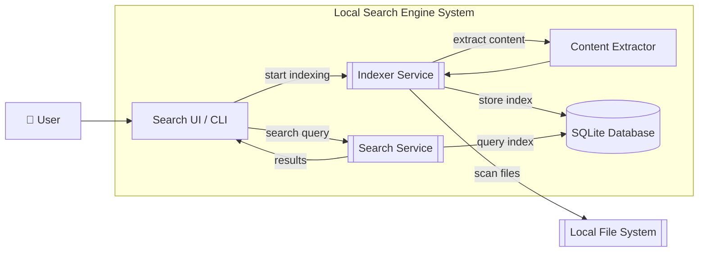
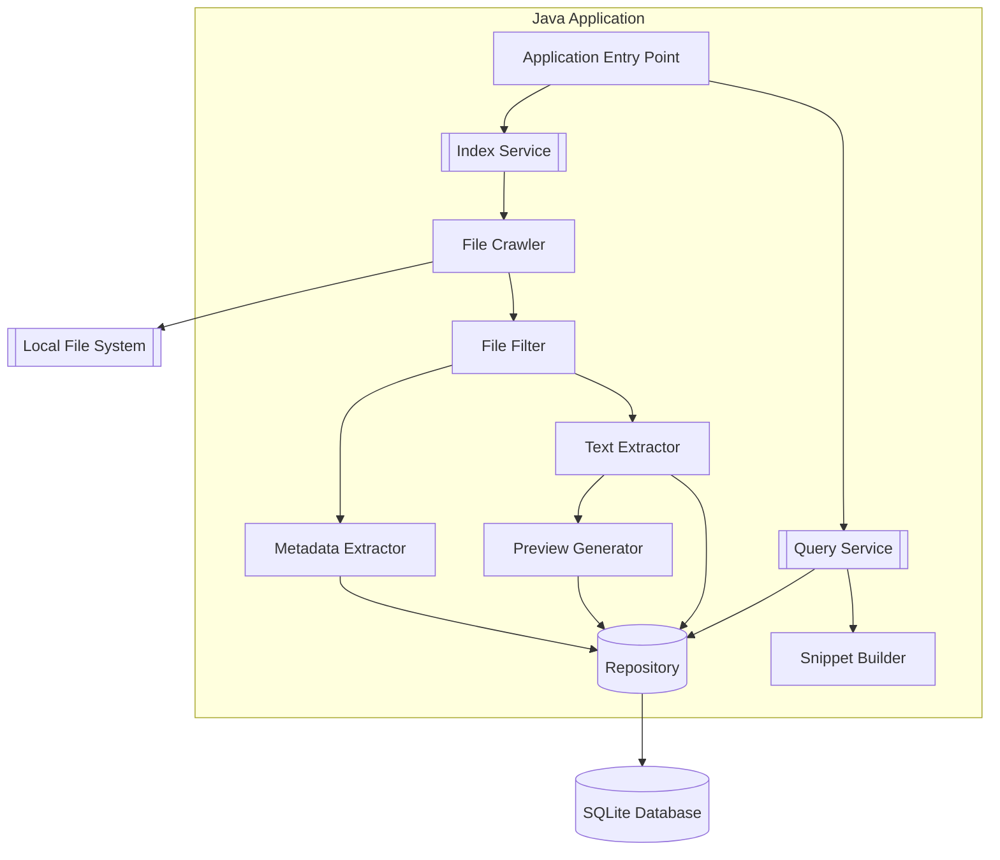

# Local Search Engine — Architecture

This document describes the architecture of the Local Search Engine, following the C4 model by Simon Brown. The system is analyzed from four perspectives: **System Context**, **Containers**, **Components**, and **Code (Classes)**. The goal is to define clear boundaries between modules so that future iterations can be implemented with minimal cost of change.

---

## 1. System Context (Level 1)

The System Context diagram shows the highest-level view of the application and how it interacts with the outside world.

* **User:** The primary actor who triggers file indexing and submits search queries against the local index.
* **Local Search Engine:** The system under development. It crawls, indexes, and searches files stored on the user's machine.
* **Local File System (External System):** The underlying OS directory structure. The engine reads files from here to extract content and metadata — it never modifies them.

---

## 2. Containers (Level 2)

Containers represent the major deployable / runnable units that make up the system.

* **Search UI / CLI:** The interface through which the user issues commands (index, search) and views ranked results with contextual file previews.
* **Indexer Service:** Scans the file system starting from a configured root path, delegates content extraction to the parser, and persists the results into the database.
* **Search Service:** Receives a search query, executes it against the database index, and returns ranked results back to the UI.
* **Content Extractor:** Parses raw file bytes and extracts indexable text and metadata. Used internally by the Indexer Service.
* **SQLite Database:** Persistent storage for file metadata, extracted content, and search previews. Both the Indexer and Search services interact with it.

---

## 3. Components (Level 3)

This level breaks the Java application into its internal structural building blocks.

* **Application Entry Point:** Bootstraps the application and delegates to the Index Service or Query Service depending on the user command.
* **Index Service:** Orchestrates the full indexing pipeline — crawling, filtering, extraction, and persistence.
* **Query Service:** Orchestrates query execution. It fetches matching records from the Repository and uses the Snippet Builder to produce contextual previews around matched terms.
* **File Crawler:** Recursively walks the file system from a given root path. Handles edge cases such as symlink loops and permission errors.
* **File Filter:** Decides which discovered files should proceed through the extraction pipeline (based on extension, size, ignore rules, etc.).
* **Metadata Extractor:** Extracts filesystem metadata (file name, path, size, last modified timestamp) and stores it into a `FileRecord`.
* **Text Extractor:** Reads and extracts the textual content of a file for full-text indexing.
* **Preview Generator:** Produces a short content preview (e.g., first N lines) suitable for displaying alongside search results.
* **Repository:** The single persistence gateway — abstracts all database access so the rest of the application remains decoupled from SQLite specifics.
* **Snippet Builder:** Builds context-aware text snippets around matched query terms to highlight relevant passages in search results.

---

## 4. Code (Level 4)
