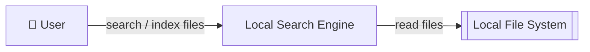
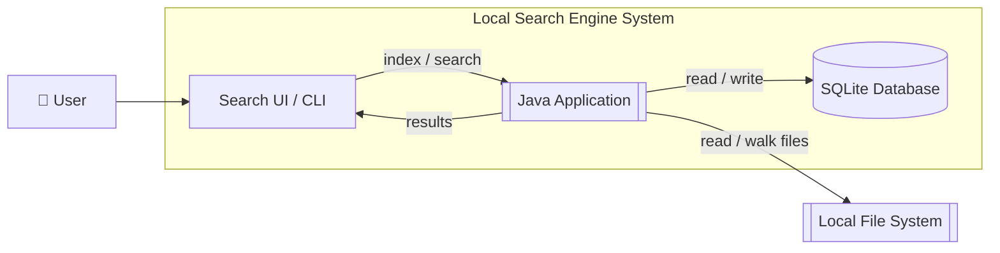
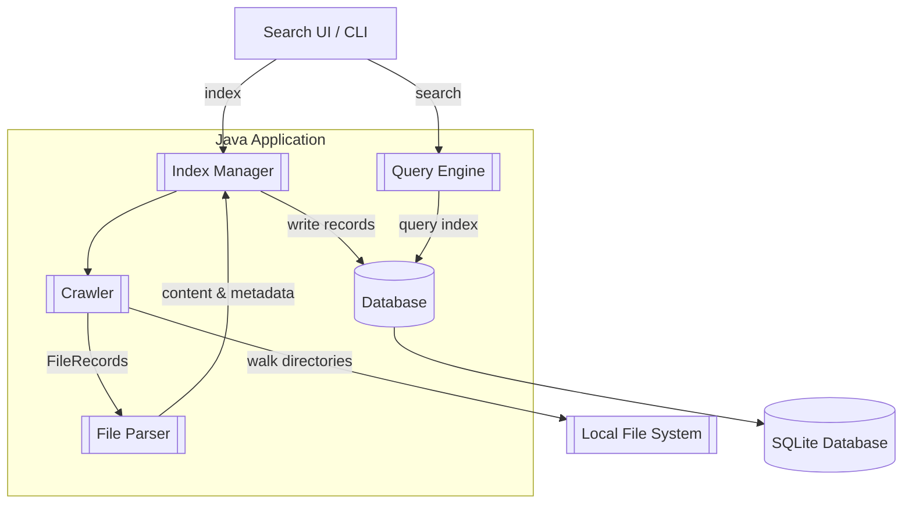
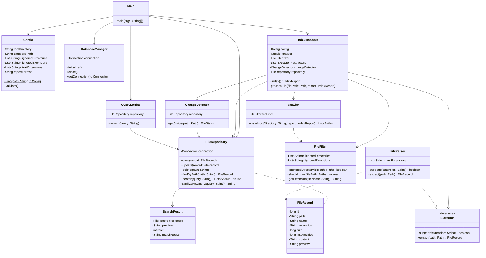

# Local Search Engine — Architecture

This document describes the architecture of the Local Search Engine, following the C4 model by Simon Brown. The system is analyzed from four perspectives: **System Context**, **Containers**, **Components**, and **Code (Classes)**. The goal is to define clear boundaries between modules so that future iterations can be implemented with minimal cost of change.

---

## 1. System Context (Level 1)

The System Context diagram shows the highest-level view of the application and how it interacts with the outside world.

* **User:** The primary actor who triggers file indexing and submits search queries against the local index.
* **Local Search Engine:** The system under development. It crawls, indexes, and searches files stored on the user's machine.
* **Local File System (External System):** The underlying OS directory structure. The engine reads files from here to extract content and metadata — it never modifies them.

---

## 2. Containers (Level 2)

Containers represent the major deployable / runnable units that make up the system.

* **Search UI / CLI:** The interface through which the user issues commands (index, search) and views ranked results with contextual file previews.
* **Java Application:** The core application that orchestrates file crawling, content parsing, indexing, and query execution.
* **SQLite Database:** Persistent storage for file metadata, extracted content, and search previews. Used by both the indexing and search pipelines.

---

## 3. Components (Level 3)

Components are the major structural building blocks inside the **Java Application** container.

* **Crawler:** Recursively walks the filesystem from a configured root path. Handles edge cases such as symlink loops and permission errors, and emits `FileRecord` objects to the File Parser.
* **File Parser:** Identifies file types and extracts standard metadata (file name, path, size, timestamps) as well as textual content. It also generates contextual search previews appropriate for the specific file type.
* **Index Manager:** Orchestrates the indexing pipeline — triggers the Crawler, receives parsed records from the File Parser, and writes them to the Database. Performs incremental indexing by detecting file changes and updating only modified records.
* **Query Engine:** Tokenizes user queries and executes them against the database index. Handles both single-word and multi-word searches and returns ranked results.
* **Database:** The single persistence gateway — abstracts all database access so the rest of the application remains decoupled from SQLite specifics.

---

## 4. Code (Level 4)

Level 4 zoom shows exactly how the components map to Java interfaces and classes.

* **Main:** Instantiates all dependencies, loads configuration, injects the `FileRepository` into the `IndexManager` and `QueryEngine`, and runs the interactive REPL.
* **Config:** POJO that dynamically deserializes the JSON configuration.
* **FileRepository / DatabaseManager:** Decouples core logic from SQLite-specific database connection and raw SQL.
* **Extractor / FileParser:** Interfaces out the content ingestion step so adding support for new proprietary formats (e.g. PDF) just requires injecting a new class implementing `Extractor`.
* **ChangeDetector:** Ensures speedier subsequent indexing passes by checking SQL records against actual FS bounds.
